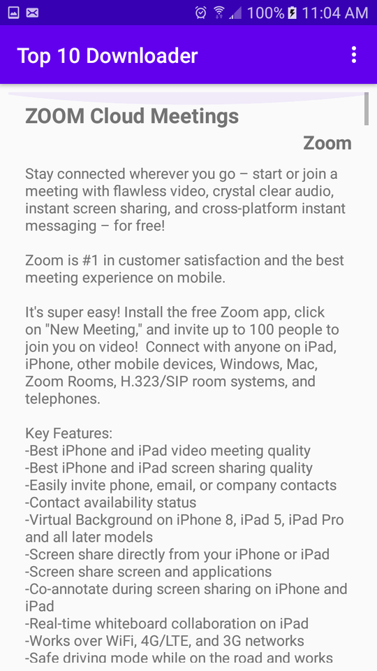
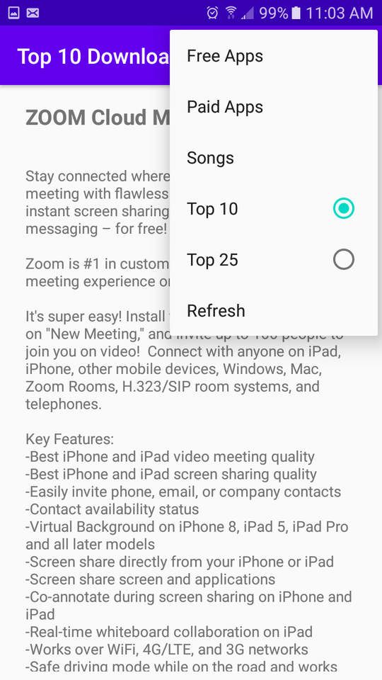

# Live RSS Feed Viewer
An Android app made in Android Studio and coded with Java, that converts live RSS feed XML data into organized read-able sections for an end user. The concept of this app is that every mainstream company or website has a live RSS feed in which data is updated continously in XML. So, I made a live RSS feed reader that uses this live XML data and converts it into read-able sections for a user to toggle between pages and have a better user experience. This app has three sections, top free apps, paid apps, and songs. Each page has the name of the app, the company which created it, and the given summary of each of their purposes and uses. Users can also toggle between top 10 and top 25. 
 
 # Data Source
 For showcase, I used Apples top chart section for free apps, paid apps, and songs. However, this can be done with any live RSS feed.
 Apples RSS information can be found here: https://www.apple.com/rss/
 
 # How To Download The App
 I have provided an APK file so it's easy for Android users to download and use the app. The file is `app-debug.apk` located in this repository.
 
 # App Platform
 
  
 
 
